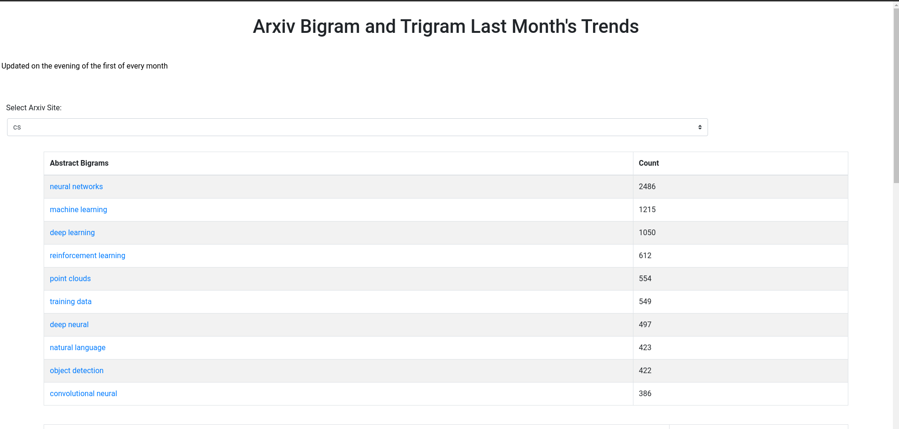

# arxivTrendAnalysis

Analyze top arxiv bigrams and trigrams.  This code is essentially what is used to for this [Arxiv Trends](http://arxivtrendsite.s3-website.us-east-2.amazonaws.com/) site.




# Python analysis files

The file 'ArxivMonthlyTrendMailer' gets the top bigrams and trigrams of arxiv for the prior month.  To do so it uses arxiv's OAI interface.

This file creates the file "trendAnalysis.js" which the site uses to display content.  Essentially, the js file is a variable
assignment to a json object.  The file also e-mails you the top trends as well.

There is some code to push things to S3.  The reason is I host to s3 and essentially just update the 'trendAnalysis.js' file each month.

In order to use one needs to create a 'config.py' file and create a few dictionaries. See 'sampleConfig.py' to see the necessary dictionary information.


# Website

Essentially the code for the website.  Once running 

```
npm run build
```

you should be able to host the site on S3 or any other static site host.